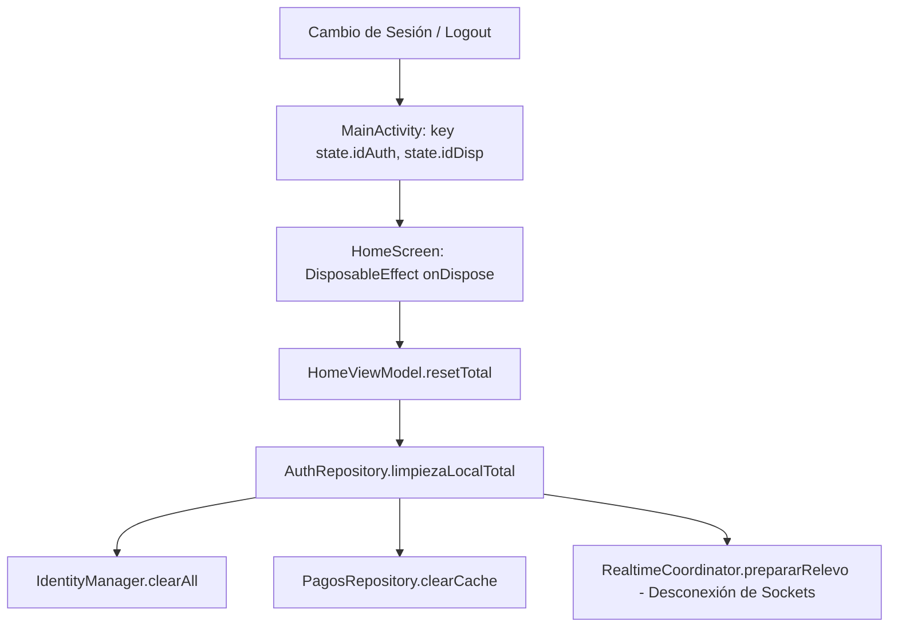

# Solución Técnica: Aislamiento Estricto de Sesión, Ciclo de Vida en Jetpack Compose y Consistencia REST/Realtime

Este documento registra el patrón arquitectónico implementado para resolver la fuga de datos (data leakage) entre sesiones y la discrepancia de datos en frío vs. caliente (Swipe / Cold start) en aplicaciones móviles Android con Jetpack Compose y Supabase.

---

## 1. Contexto y Diagnóstico del Problema

### A. Ciclo de Vida de ViewModels en Compose sin NavHost
En arquitecturas de Jetpack Compose donde la navegación se realiza de forma reactiva con un bloque condicional en `MainActivity`:
```kotlin
when (state) {
    is AuthState.Authenticated -> HomeScreen()
    is AuthState.Unauthenticated -> LoginScreen()
}
```
Si se utiliza `viewModel: HomeViewModel = hiltViewModel()` dentro de `HomeScreen`, el `ViewModelStoreOwner` por defecto es la propia `MainActivity`.
* **Consecuencia Crítica:** Al cambiar a `AuthState.Unauthenticated`, `HomeScreen` sale de la composición, pero el `HomeViewModel` **permanece vivo en la memoria RAM** de la Activity. Si el usuario inicia sesión nuevamente (con otra cuenta o en otra sucursal/caja), se reutiliza la misma instancia del ViewModel con los datos y flujos de la sesión anterior.

### B. Singletons y Coordinadores Realtime en Memoria
Clases marcadas con `@Singleton` (`AuthIdentityManager`, `PagosRepositoryImpl`, `RealtimeCoordinator`) retienen flujos (`StateFlow`, `SharedFlow`) y conexiones WebSocket activas si no se implementa un método de purga explícito al cerrar sesión (`signOut`).

### C. Consultas REST no Aisladas por Contexto Físico
Al consultar tablas de participaciones o bitácoras (`NotificacionesAUsuarios`) filtrando únicamente por `IdUsuario`, se traen los registros históricos de todas las terminales/cajas donde ese usuario haya operado en la empresa. Si el frontend cruza estos datos con la memoria local, se produce una fuga visual de información entre cajas.

### D. Discrepancia REST vs. Realtime en Memoria
Si el observador de Realtime (`HomePaymentsManager.integrarNotificacion`) agrega notificaciones a la lista en memoria sin aplicar las mismas reglas de exclusión que la consulta REST inicial (`obtenerPagosDelDia`), la app acumula elementos en RAM que desaparecen al forzar el cierre de la app (Swipe / Cold start), provocando conteos erráticos (ej. 1 -> 3 -> 2).

---

## 2. Patrón Arquitectónico de Solución



### Regla 1: Destrucción Forzada en Compose mediante `key()`
Envolver el composable principal de la sesión con una clave compuesta de las identidades activas:
```kotlin
is AuthState.Authenticated -> {
    androidx.compose.runtime.key(state.idAutorizacion, state.idDispositivo) {
        HomeScreen(
            mainViewModel = viewModel,
            authState = state
        )
    }
}
```
Esto le indica al motor de Compose que descarte completamente el sub-árbol y su estado asociado si cambia la autorización o la terminal física.

### Regla 2: Purga Inmediata en `onDispose`
En la pantalla principal, registrar un `DisposableEffect` vinculado a las credenciales para ejecutar la limpieza inmediata al salir de la pantalla:
```kotlin
DisposableEffect(authState.idAutorizacion, authState.idDispositivo) {
    onDispose {
        viewModel.resetTotal()
    }
}
```

### Regla 3: Cascada de Purga en `signOut()` y `desconectarCajaLocal()`
El repositorio de autenticación debe orquestar la limpieza de todos los Singletons antes y después de invalidar el token de Supabase:
```kotlin
private suspend fun limpiezaLocalTotal() {
    userPrefs.clearAll()
    pagosRepository.clearCache()
    pagosRepository.prepararRelevo() // Desconecta canales WebSocket
    vinculacionRepository.reset()
    identityManager.clearAll()        // Vacía StateFlows de autorizaciones
    try {
        auth.signOut()
        auth.clearSession()
    } catch (e: Exception) {
        Log.e("AuthRepo", "Error al cerrar sesión: ${e.message}")
    }
}
```

### Regla 4: Consultas Relacionales con `!inner` en PostgREST
Para filtrar una tabla intermedia por un campo de la tabla relacionada (ej. filtrar `NotificacionesAUsuarios` por el `IdDispositivo` de `NotificacionesXDispositivo`):
```kotlin
postgrest["NotificacionesAUsuarios"].select(
    Columns.raw("*, NotificacionesXDispositivo!inner(IdDispositivo)")
) {
    filter {
        eq("IdUsuario", user.id)
        eq("NotificacionesXDispositivo.IdDispositivo", idDispositivo)
    }
}
```

### Regla 5: Homologación Estricta de Filtros Realtime y REST
En los gestores de memoria reactiva (`HomePaymentsManager`), toda inserción o actualización por Realtime debe respetar exactamente los mismos filtros de privacidad y ciclo de vida que la consulta REST:
```kotlin
val esValidaParaJornada = !notificacion.Privada && 
    notificacion.EstadoProgreso in listOf("PENDIENTE", "COMPLETADO", "REVISION")

if (index != -1) {
    if (!esValidaParaJornada) {
        newList.removeAt(index) // Depurar de memoria si cambió a estado inválido
    } else {
        newList[index] = notificacion
    }
}
```

---

## 3. Guía de Reutilización para Nuevas Apps
Al desarrollar un nuevo cliente móvil o desktop en el ecosistema NotificaPe:
1. Verificar si la app usa navegación sin NavHost. De ser así, aplicar `key()` en Compose y `DisposableEffect(onDispose)`.
2. Todo Singleton que exponga `StateFlow` a la UI debe tener un método explícito `clear()` o `reset()`.
3. Nunca confiar únicamente en el `IdUsuario` para consultas operativas si la entidad de negocio está ligada a un terminal (`IdDispositivo`) o sucursal.
