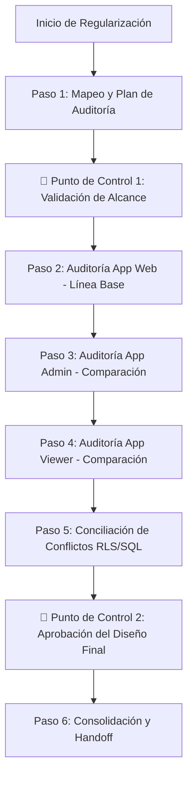

# Solución Técnica: Alineación de Template y Estrategia de Regularización

Este documento registra el análisis del error de consistencia detectado en la plantilla de especificaciones (`NotificaPe_Specs`), las acciones tomadas para solucionarlo, y la decisión técnica sobre cómo se ejecutará el proceso de integración de los proyectos existentes.

---

## 1. Reporte del Error de Rutas del Template Original

### Descripción del Problema
En la plantilla base del proyecto de especificaciones, existía una inconsistencia crítica entre la estructura del disco físico y las instrucciones del agente orquestador en [.agents/AGENTS.md](file:///c:/Trabajo/Proyectos/NotificaPe/NotificaPe_Specs/.agents/AGENTS.md):
* **Estructura Física original:**
  ```
  NotificaPe_Specs/
  ├── 1_introduction/
  ├── 2_management/
  └── 3_development/
  ```
* **Instrucciones en `AGENTS.md` y `README.md`:** El agente tenía instrucciones explícitas de buscar y crear archivos en `management/` (sin número), pero en otras secciones hacía referencia a `3_development/` (con número).

### Impacto
Si el agente ejecutaba comandos como `/iniciar` (Fase A) o las fases de handoff, el sistema crearía un nuevo directorio físico `management/` en la raíz de forma paralela a `2_management/`. Esto provocaría duplicación de datos, pérdida de trazabilidad de los changelogs históricos, y errores de lectura/escritura en los subagentes.

### Solución Aplicada (Opción A)
1. **Renombrado Físico:** Se renombraron las carpetas en el disco eliminando los prefijos numéricos:
   * `2_management/` -> [management/](file:///c:/Trabajo/Proyectos/NotificaPe/NotificaPe_Specs/management)
   * `3_development/` -> [development/](file:///c:/Trabajo/Proyectos/NotificaPe/NotificaPe_Specs/development)
2. **Corrección de Instrucciones:** Se editaron todas las referencias dentro de [.agents/AGENTS.md](file:///c:/Trabajo/Proyectos/NotificaPe/NotificaPe_Specs/.agents/AGENTS.md) para reemplazar `3_development` por `development`, garantizando consistencia absoluta en el flujo interno de desarrollo.

---

## 2. Decisión de Diseño: Estrategia de Regularización Secuencial (Paso a Paso)

Debido al volumen de información desalineada (particularmente los históricos en `docs/` y bases de datos), se ha tomado la decisión de **no realizar la regularización en paralelo o simultánea**, sino aplicar un enfoque estructurado **Secuencial (App por App)**.



### Justificación Técnica
1. **Prevención de Saturación de Contexto:** Tres repositorios con lógicas de negocio diferentes analizados en paralelo desbordarían el contexto de la IA y generarían reportes difíciles de auditar por el usuario.
2. **Homogeneización del Briefing y Blueprint:** Al analizar secuencialmente, el agente puede consolidar primero la visión de producto y diseño técnico de la App Web (usualmente la principal), y luego verificar qué porciones de esa lógica cambian o se expanden en las aplicaciones Android (`admin` y `viewer`), previniendo choques conceptuales.
3. **Consolidación Incremental de Base de Datos:** Permite construir el script inicial de la base de datos como base cero (Línea Base) y acumular scripts `ALTER` e in-place de forma lógica a medida que se auditan las demás aplicaciones.

---

## 3. Acciones para Promoción Base (Acción 4)
Cuando se ejecute la **Acción 4** ("Promover conocimiento local a la plantilla base"), se deberá proponer al mantenedor de la plantilla original:
1. Eliminar permanentemente los prefijos numéricos `2_` y `3_` del repositorio de plantillas.
2. Incorporar esta guía de regularización secuencial paso a paso en el bloque de conocimiento de la Acción 3.
